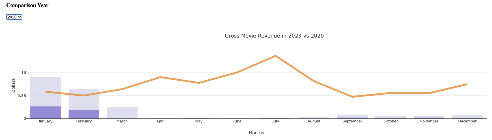
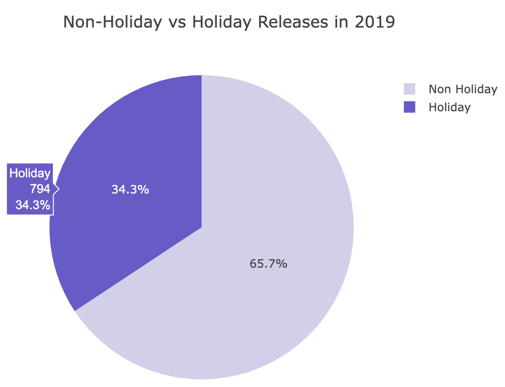
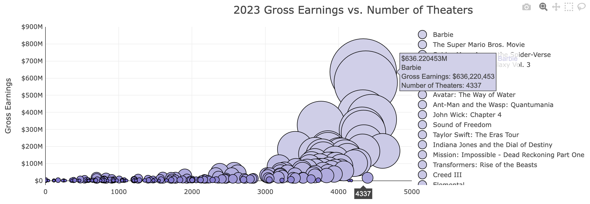
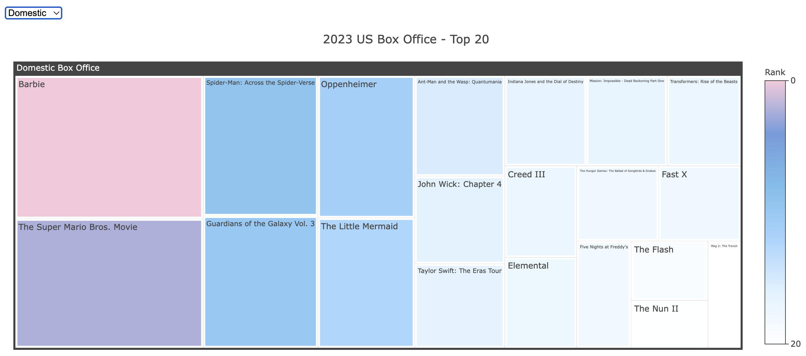
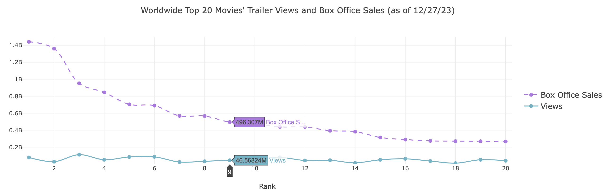

# 2023_movies

**Name: 2023_Movies**

## **Description:**  
Attention all movie buffs! It is now January 2024 and our 2023 Movie Wrap is overdue! Our project takes a deep dive into all of the cinematic feats of 2023 and explores different topics regarding these films.  

We gathered data from Box Office Mojo by IDMDbPro to see if we can uncover any interesting findings or trends. Lucky for you, we found both! We used a series of graphs and charts to help visualize our discoveries. They’re all interactive to help understand the bigger picture–motion picture, that is.  

So grab your popcorn and let’s get visualizing!  

## **Act I: At the Movies in 2023**  
Are movies today bringing in the same kind of revenue as a few years ago? The answer is…not quite. Although the world has since resumed life after COVID shutdowns, the box office numbers have yet to fully recover. Feel free to adjust the dropdown to compare revenue each year up to 2023.  

Holidays may also play a strategic part in releasing movies. Hover over the bar and pie charts to see exactly how many movies have been released on a regular day versus on a holiday.  

## **Act II: Top Movies of All time vs. Top Movies in 2023**  
Movies make how much?? This next set of graphs takes a look into how much the movies in 2023 made and how that compares to some of the greatest movies of all time. Barbie took the lead last year by bringing in a whopping $636 million dollars. The top movies of 2023 is a long list, but you can isolate a movie on the first scatter plot by double clicking on a movie title.

Maybe a movie’s revenue depends on the distributor. Take a look by hovering over the next few charts. Eventually you’ll find that although 2023 was the year of Barbie, it still does not come close to some of the greats.  

## **Act III: Top Domestic Movies vs. Top Worldwide Movies in 2023**  
We know there are many films that did well in the United States, but how did they do overseas? You’d be surprised to see that the ranking overseas slightly differs from the domestic ranking. Hover over the bar chart to find out!

The treemap view brings no surprise that Barbie was #1 both domestically and worldwide. Feel free to adjust the dropdown to compare. Hover over the bubble chart to see how much the top 20 movies in the world did.  

## **Act IV: Box office Records vs. YouTube Trailer Hits**  
Have you ever wondered if movie trailers had any effect on the success of a movie? We used Youtube APIs to help us answer that question. As shown in the first scatter plot, trailer views can have a lot of variation. However based on our findings, there doesn’t seem to be a clear correlation between movie trailer views and its ranking or sales. Hover over the scatter and line graphs to see exactly how many trailer views a ranked movie received, compared to how much the movie made.  

## **Visuals:**

## **Authors:**  
Daniel Rose  
Samantha Rose Pabalate  
Cherif Arkam  
Sung Youn Hutchison  
Wingtung Lee  

**Plot twist! We had help.**  

## **Acknowledgments:**  
Dependencies: Pandas, Plotly, Matplotlib, Seaborn, Pathlib, Numpy, O, Json, Googleapiclient

Box Office Mojo  
https://www.boxofficemojo.com/month/?ref_=bo_nb_ql_secondarytab  
Top 200 Movies of 2023 Dataset  
https://www.kaggle.com/datasets/mohammadrizwansajjad/top-200-movies-of-2023  
Python Seaborn  
https://seaborn.pydata.org/examples/index.html  
Matplotlib Examples  
https://matplotlib.org/stable/gallery/index  
D3 (JavaScript Visualization library) examples gallery  
https://observablehq.com/@d3/gallery?utm_source=d3js-org&utm_medium=hero&utm_campaign=try-observable  
BOKEH, Python based visualization library, creates interactive visuals for web browsers  
https://docs.bokeh.org/en/latest/docs/gallery.html#  
Python Visualization with Bokeh  
https://www.youtube.com/watch?v=2TR_6VaVSOs  
Packed-bubble chart  
https://matplotlib.org/stable/gallery/misc/packed_bubbles.html#sphx-glr-gallery-misc-packed-bubbles-py  

That’s all folks!
